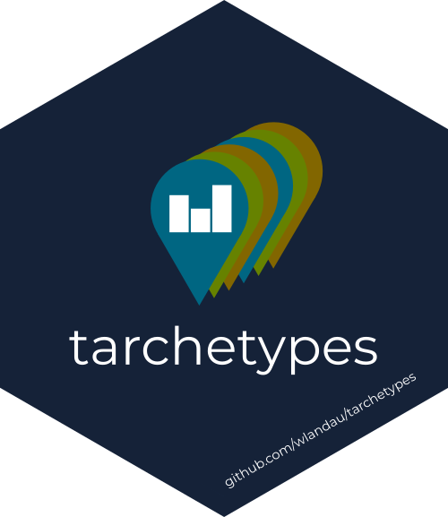

```{r, include = FALSE}
knitr::opts_chunk$set(
  collapse = TRUE,
  comment = "#>",
  fig.path = "man/figures/README-",
  out.width = "100%"
)
```

# tarchetypes 

[](https://github.com/ropensci/software-review/issues/401)
[](https://zenodo.org/badge/latestdoi/282774543)
[](https://wlandau.github.io/targetopia/)
[](https://cran.r-project.org/package=tarchetypes)
[](https://www.repostatus.org/#active)
[](https://github.com/ropensci/tarchetypes/actions?query=workflow%3Acheck)
[](https://codecov.io/gh/ropensci/targets)
[](https://github.com/ropensci/tarchetypes/actions?query=workflow%3Alint)

The `tarchetypes` R package is a collection of target and pipeline archetypes for the [`targets`](https://github.com/ropensci/targets) package. These archetypes express complicated pipelines with concise syntax, which enhances readability and thus reproducibility. Archetypes are possible because of the flexible metaprogramming capabilities of [`targets`](https://github.com/ropensci/targets). In [`targets`](https://github.com/ropensci/targets), one can define a target as an object outside the central pipeline, and the [`tar_target_raw()`](https://docs.ropensci.org/targets/reference/tar_target_raw.html) function completely avoids non-standard evaluation. That means anyone can write their own niche interfaces for specialized projects. `tarchetypes` aims to include the most common and versatile archetypes and usage patterns.

## Target archetype example

Consider the following R Markdown report.

```{r, echo = FALSE, comment = ""}
lines <- c(
  "---",
  "title: report",
  "output: html_document",
  "---",
  "",
  "```{r}",
  "library(targets)",
  "tar_read(dataset)",
  "```"
)
cat(lines, sep = "\n")
```

We want to define a target to render the report. And because the report calls `tar_read(dataset)`, this target needs to depend on `dataset`. Without `tarchetypes`, it is cumbersome to set up the pipeline correctly.

```{r, eval = FALSE}
# _targets.R
library(targets)
list(
  tar_target(dataset, data.frame(x = letters)),
  tar_target(
    report, {
      # Explicitly mention the symbol `dataset`.
      list(data)
      # Return relative paths to keep the project portable.
      fs::path_rel(
        # Need to return/track all input/output files.
        c( 
          rmarkdown::render(
            input = "report.Rmd",
            # Always run from the project root
            # so the report can find _targets/.
            knit_root_dir = getwd(),
            quiet = TRUE
          ),
          "report.Rmd"
        )
      )
    },
    # Track the input and output files.
    format = "file",
    # Avoid building small reports on HPC.
    deployment = "main"
  )
)
```

With `tarchetypes`, we can simplify the pipeline with the `tar_render()` archetype.

```{r, eval = FALSE}
# _targets.R
library(targets)
library(tarchetypes)
list(
  tar_target(dataset, data.frame(x = letters)),
  tar_render(report, "report.Rmd")
)
```

Above, `tar_render()` scans code chunks for mentions of targets in `tar_load()` and `tar_read()`, and it enforces the dependency relationships it finds. In our case, it reads `report.Rmd` and then forces `report` to depend on `dataset`. That way, `tar_make()` always processes `dataset` before `report`, and it automatically reruns `report.Rmd` whenever `dataset` changes.

## Pipeline archetype example

[`tar_plan()`](https://docs.ropensci.org/tarchetypes/reference/tar_plan.html) is a drop-in replacement for [`drake_plan()`](https://docs.ropensci.org/drake/reference/drake_plan.html) in the [`targets`](https://github.com/ropensci/targets) ecosystem. 
It lets users write targets as name/command pairs without having to call [`tar_target()`](https://docs.ropensci.org/targets/reference/tar_target.html).

```{r, eval = FALSE}
tar_plan(
  tar_file(raw_data_file, "data/raw_data.csv", format = "file"),
  # Simple drake-like syntax:
  raw_data = read_csv(raw_data_file, col_types = cols()),
  data =raw_data %>%
    mutate(Ozone = replace_na(Ozone, mean(Ozone, na.rm = TRUE))),
  hist = create_plot(data),
  fit = biglm(Ozone ~ Wind + Temp, data),
  # Needs tar_render() because it is a target archetype:
  tar_render(report, "report.Rmd")
)
```

## Installation

Install the GitHub development version to access the latest features and patches.

```{r, eval = FALSE}
library(remotes)
install_github("ropensci/tarchetypes")
```

## Documentation

For specific documentation on `tarchetypes`, including the help files of all user-side functions, please visit the [reference website](https://docs.ropensci.org/tarchetypes/). For documentation on [`targets`](https://github.com/ropensci/targets) in general, please visit the [`targets` reference website](https://docs.ropensci.org/targets/). Many of the linked resources use `tarchetypes` functions such as [`tar_render()`](https://docs.ropensci.org/tarchetypes/reference/tar_render.html).

## Code of conduct

Please note that this package is released with a [Contributor Code of Conduct](https://ropensci.org/code-of-conduct/).

## Citation

```{r}
citation("tarchetypes")
```
